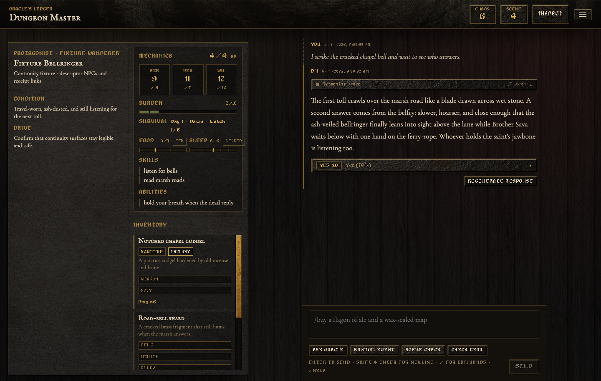
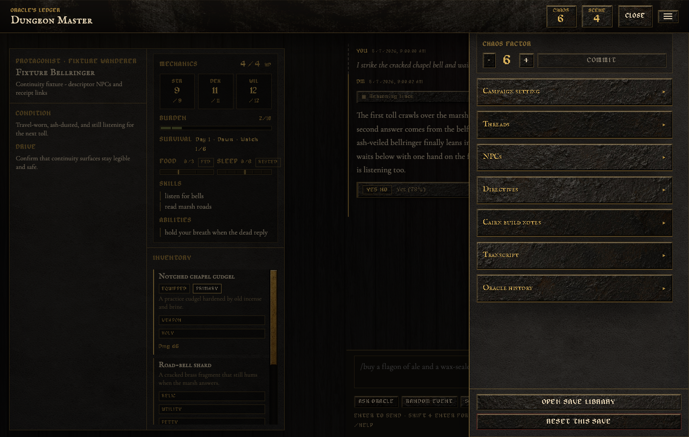
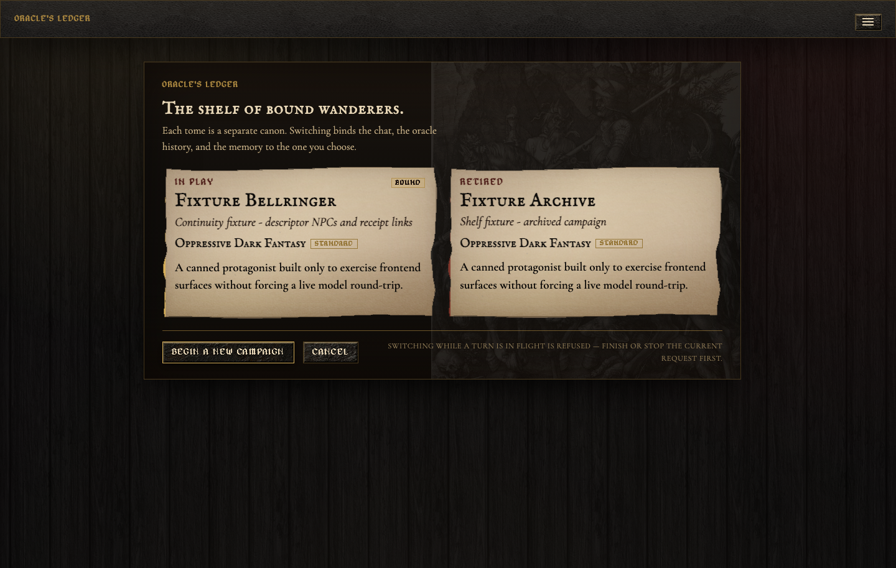
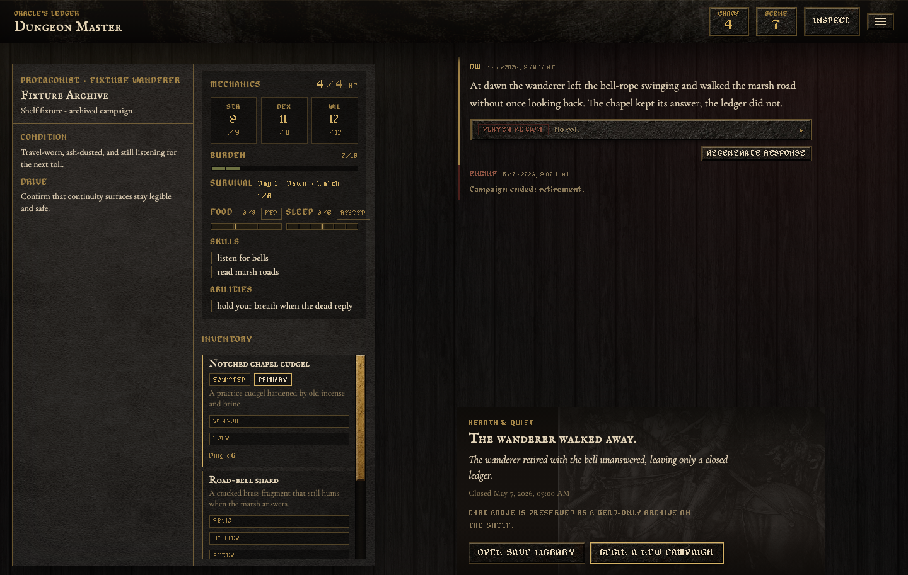

# Dungeon Master

A personal solo TTRPG harness where Python owns deterministic mechanics and a LiteLLM-routed model is restricted to narration. The frontend is a bespoke Svelte 5 grimoire UI; the backend is a FastAPI server.

[](https://github.com/armantark/Dungeon-Master/releases/tag/desktop-v0.1.1)
[](https://github.com/armantark/Dungeon-Master/releases/download/desktop-v0.1.1/Dungeon.Master_0.1.1_aarch64.dmg)
[](https://github.com/armantark/Dungeon-Master/releases/download/desktop-v0.1.1/Dungeon.Master_0.1.1_x64-setup.exe)
[](https://github.com/armantark/Dungeon-Master/releases/download/desktop-v0.1.1/Dungeon.Master_0.1.1_amd64.AppImage)
[](https://github.com/armantark/Dungeon-Master/releases)

## Screenshots

These captures use the isolated fixture save library (`dungeon-master-fixtures`) so the UI can be shown without mutating a live campaign.









## What It Does

- Tracks canonical state in `data/game_state.json` and writes append-only events to `data/events.jsonl`.
- Snapshots a checkpoint into `data/checkpoints/` after every meaningful turn.
- Uses a deterministic oracle for yes/no questions, random events, and scene checks.
- Adds a Cairn 2e-inspired backend rules layer: `STR` / `DEX` / `WIL`, HP, armor, burden, item tags, saves, auto-hit damage, critical damage, scars, and recovery.
- Performs a one-time mechanics backfill for the current authored character when that character first becomes mechanically active, so existing setup work is preserved.
- Generates the opening scene, threads, NPCs, and oracle word banks on first launch (or after a reset) using the configured LLM.
- Keeps the LLM out of dice rolls, chaos factor, threads, NPCs, and any state mutation.
- Falls back to deterministic placeholder narration when no model is configured.

## Architecture

```text
+------------------+        HTTP / JSON          +-----------------------+
|  Svelte 5 + TS   |  <----------------------->  |       FastAPI         |
|  (web/, Vite)    |        /api/*               |  (dungeon_master.api) |
+------------------+                             +-----------+-----------+
                                                             |
                                                             v
                                          +-----------------------------------+
                                          |        GameService                |
                                          |  - OracleEngine (Python, dice)    |
                                          |  - CairnEngine  (Python, rules)   |
                                          |  - StateStore   (json + events)   |
                                          |  - CampaignGenerator (LLM bootstrap) |
                                          |  - NarrativeEngine   (LLM via LiteLLM) |
                                          +-----------------------------------+
```

The HTTP surface is intentionally thin: every mutation returns the entire `GameState`, so the frontend never reconciles partial diffs.

## Run

Two processes (one terminal per process is easiest):

```shell
# 1) backend
uv sync
uv run dungeon-master            # serves http://127.0.0.1:8000

# 2) frontend
cd web
npm install
npm run dev                      # serves http://127.0.0.1:5173
```

Open [http://127.0.0.1:5173](http://127.0.0.1:5173). Vite proxies `/api` to the FastAPI server.

To run the backend with autoreload during development:

```shell
uv run dungeon-master --reload
```

## Desktop Beta

The repo now includes a Tauri v2 desktop shell in `web/src-tauri/`.

- The Tauri app spawns a bundled Python sidecar for the FastAPI backend.
- The sidecar writes saves/runtime settings/BYOK credentials into the OS app-data directory instead of the repo-local `data/` tree.
- The frontend resolves its API base at runtime, so browser dev still uses Vite's `/api` proxy while the desktop shell points directly at the local sidecar.

Local desktop commands:

```shell
# Build the backend sidecar binary Tauri expects
cd web
npm run sidecar:build

# Run the desktop shell in dev mode
npm run tauri:dev

# Build desktop bundles for the current host platform
npm run tauri:build
```

Rust is required for the local Tauri build/dev commands. The Python sidecar build alone does not require `cargo` to be on `PATH`.

GitHub desktop release automation lives in `.github/workflows/desktop-release.yml`.
It currently targets:

- macOS on native Apple Silicon and Intel runners
- Windows x64
- Linux x64

These beta artifacts are unsigned. macOS may require right-click Open / quarantine removal, and Windows may show SmartScreen warnings until signing is added later.

## Configure The Narrative Model

Default preset is OpenRouter Kimi K2.6. The backend now also supports an app-global Gemini split preset:
- `kimi`: current behavior, using `openrouter/moonshotai/kimi-k2.6` for all backend LLM work
- `gemini_split`: `gemini/gemini-3-flash-preview` for structured routing/update work and `gemini/gemini-3.1-pro-preview` for narration plus heavier generation

The active preset is stored separately from `.env` in `data/runtime_settings.json` by default and can be read/updated through `GET /api/settings/llm` and `POST /api/settings/llm`.

Credential behavior now depends on how you run the app:

- Terminal/dev workflow: `.env` still works exactly as before.
- Desktop beta: if no usable provider key is present in the environment, the app prompts for a Gemini or OpenRouter key on first launch and stores it in a local runtime credentials file under the app-data directory.

Character interview, character drafting, and campaign bootstrap internally raise their own token budgets above the base `.env` default because Kimi K2.6 Thinking spends a large chunk of the budget on reasoning before it writes visible output.

Copy `.env.example` to `.env` and fill in the provider keys you want available:

```shell
OPENROUTER_API_KEY=
OPENROUTER_API_BASE=https://openrouter.ai/api/v1
GEMINI_API_KEY=
LITELLM_MODEL=openrouter/moonshotai/kimi-k2.6
LITELLM_REASONING_EFFORT=auto
LITELLM_EXCLUDE_REASONING=false
LITELLM_NARRATION_TEMPERATURE=1.25
LITELLM_NARRATION_MAX_TOKENS=4500
LITELLM_TIMEOUT_SECONDS=600
LITELLM_MAX_RETRIES=2
OR_APP_NAME=Dungeon Master
DUNGEON_MASTER_STATE_PATH=data/game_state.json
DUNGEON_MASTER_RUNTIME_SETTINGS_PATH=data/runtime_settings.json
DUNGEON_MASTER_CREDENTIALS_PATH=data/llm_credentials.json
```

If you stay on the default Kimi preset, `LITELLM_MODEL` remains the active backend model slug. If you switch to `gemini_split`, the backend uses the fixed Gemini 3.x LiteLLM slugs above and ignores `LITELLM_MODEL` for those runtime-routed capabilities.

## Test

```shell
uv run ruff check .
uv run mypy src tests
uv run pytest
cd web && npm run check
cd web && npm test
cd web && npm run build
```

Manual browser checks are documented in `docs/manual-testing.md`.

## Backend Mechanics API

The backend now exposes explicit Cairn-inspired mechanics routes in addition to `/api/turn`:

- `POST /api/cairn/save` — roll a `STR` / `DEX` / `WIL` save
- `POST /api/cairn/attack` — resolve outgoing player damage against target armor
- `POST /api/cairn/harm` — apply incoming damage to the player, including scars / critical damage when relevant
- `POST /api/cairn/recover` — breather, full rest, or week-scale recovery
- `POST /api/cairn/equip` — toggle item equipped state so armor / weapon semantics stay canonical

All of these return the full `GameState`, just like the rest of the API.

## Design Note

The oracle is inspired by solo game-master emulators (likelihood, chaos, scene pacing, events, threads, NPC prompts) but uses original tables — no proprietary text from Mythic GME 2e or any other system.
